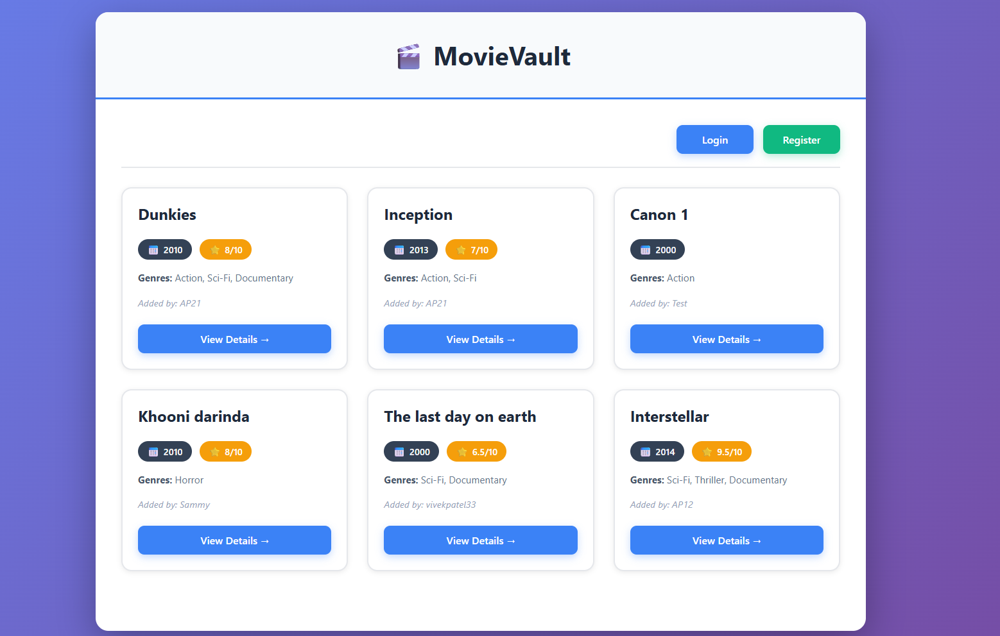
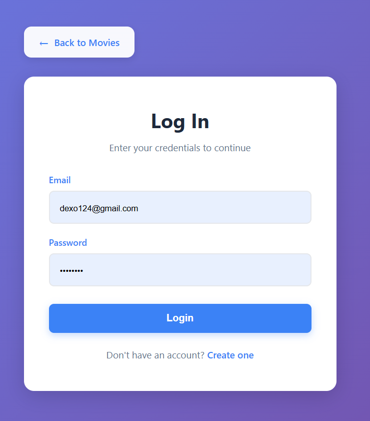
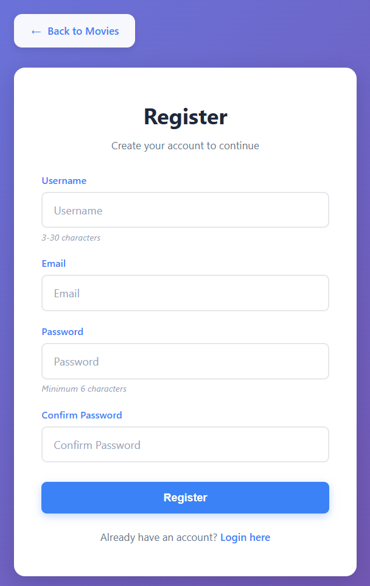
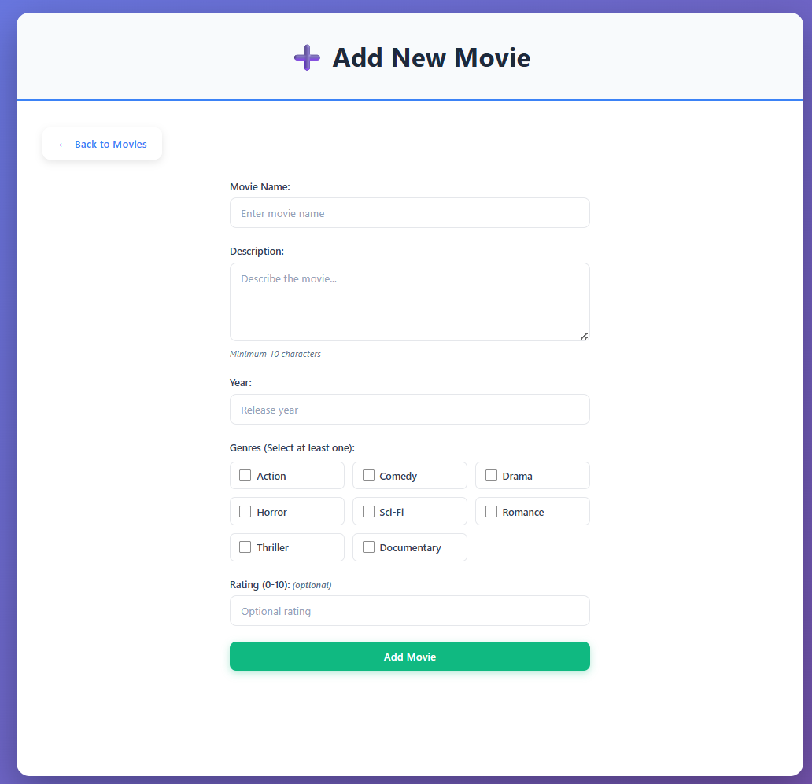
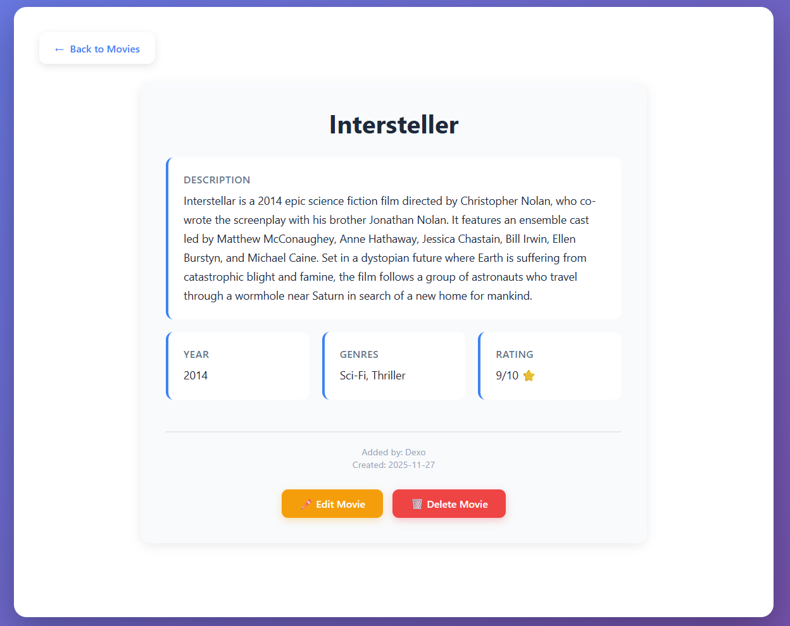

# 🎬 Movie Management Application

A full-stack web application for managing movies with user authentication, CRUD operations, and cloud deployment. Built as a final project for CPAN 212 - Modern Web Technologies.


---

## 🌟 Features

### Authentication & Authorization
- ✅ User registration with email validation
- ✅ Secure login with password hashing (bcryptjs)
- ✅ Session management with MongoDB store
- ✅ Protected routes - only logged-in users can add movies
- ✅ Ownership-based access control - users can only edit/delete their own movies

### Movie Management (CRUD)
- ✅ **Create** - Add new movies with title, description, year, genres, and rating
- ✅ **Read** - View all movies or individual movie details
- ✅ **Update** - Edit your own movies
- ✅ **Delete** - Remove your own movies with confirmation

### User Experience
- ✅ Modern, responsive UI with purple gradient theme
- ✅ Real-time form validation with inline error messages
- ✅ Professional card-based layout
- ✅ Success/error notifications
- ✅ Mobile-friendly responsive design

---

## 🛠️ Technologies Used

### Backend
- **Node.js** (v18.x) - Runtime environment
- **Express.js** (v5.1.0) - Web framework
- **MongoDB** - NoSQL database
- **Mongoose** (v8.19.2) - ODM for MongoDB
- **bcryptjs** (v3.0.2) - Password hashing
- **express-session** (v1.18.2) - Session management
- **connect-mongo** (v5.1.0) - MongoDB session store
- **express-validator** (v7.2.1) - Input validation

### Frontend
- **Pug** (v3.0.3) - Template engine
- **CSS3** - Custom styling with gradients and animations
- **JavaScript** - Client-side interactivity

### Deployment
- **Render.com** - Cloud hosting platform
- **MongoDB Atlas** - Cloud database
- **Git/GitHub** - Version control

---

## 📦 Installation

### Prerequisites
- Node.js (v18 or higher)
- MongoDB (local or Atlas account)
- Git

### Local Setup

1. **Clone the repository**
```bash
   git clone https://github.com/Alko11-code/movie-app.git
   cd movie-app
```

2. **Install dependencies**
```bash
   npm install
```

3. **Create `.env` file**
```env
   MONGODB_URI=mongodb://localhost:27017/movie-app
   SESSION_SECRET=your-secret-key-here
   NODE_ENV=development
   PORT=3000
```

4. **Start MongoDB** (if running locally)
```bash
   mongod
```

5. **Run the application**
```bash
   npm start
```

6. **Open in browser**
```
   http://localhost:3000
```

---

## 🚀 Deployment

### Deploying to Render.com

1. **Create MongoDB Atlas Cluster**
   - Sign up at [mongodb.com/atlas](https://www.mongodb.com/cloud/atlas)
   - Create a free cluster
   - Create database user
   - Whitelist all IPs (0.0.0.0/0)
   - Get connection string

2. **Push to GitHub**
```bash
   git add .
   git commit -m "Ready for deployment"
   git push origin main
```

3. **Deploy on Render**
   - Sign up at [render.com](https://render.com)
   - Create new Web Service
   - Connect your GitHub repository
   - Configure settings:
     - **Build Command:** `npm install`
     - **Start Command:** `node app.js`
     - **Environment:** Node

4. **Set Environment Variables**
```
   MONGODB_URI=your-mongodb-atlas-connection-string
   SESSION_SECRET=your-secret-key
   NODE_ENV=production
```

5. **Deploy!** 🎉

**Live Demo:**  [React-Movie-App](https://react-movie-app-ufvs.onrender.com/movies)

---

## 📖 Usage

### 1. Register an Account
- Click "Create one" on login page
- Enter username, email, and password
- System validates input and creates account

### 2. Login
- Enter email and password
- Redirected to movies page upon success

### 3. Add a Movie
- Click "Add Movie" button
- Fill in movie details:
  - Name (1-200 characters)
  - Description (minimum 10 characters)
  - Year (1888 to current year)
  - Genres (select at least one)
  - Rating (0-10, optional)
- Submit form

### 4. View Movies
- All movies displayed in card grid
- Shows: name, year, rating, genres, author
- Click "View Details" for full information

### 5. Edit/Delete Your Movies
- Only visible on movies you created
- Edit: Modify any field and save
- Delete: Click delete and confirm

### 6. Logout
- Click "Logout" button in navigation

---

## 📁 Project Structure
```
movie-app/
├── config/
│   └── database.js          # MongoDB connection
├── models/
│   ├── User.js              # User schema & methods
│   └── Movie.js             # Movie schema
├── routes/
│   ├── auth.js              # Authentication routes
│   ├── movies.js            # Movie CRUD routes
│   └── index.js             # Home route
├── middleware/
│   ├── auth.js              # Authentication middleware
│   └── validation.js        # Input validation
├── views/
│   ├── layout.pug           # Base template
│   ├── index.pug            # Movie list page
│   ├── auth/
│   │   ├── login.pug        # Login form
│   │   └── register.pug     # Registration form
│   └── movies/
│       ├── add.pug          # Add movie form
│       ├── edit.pug         # Edit movie form
│       └── details.pug      # Movie details page
├── public/
│   ├── css/
│   │   └── style.css        # Main stylesheet
│   └── js/
│       └── delete-movie.js  # Delete confirmation
├── .env                     # Environment variables
├── .gitignore               # Git ignore file
├── app.js                   # Main application file
├── package.json             # Dependencies
├── Procfile                 # Render deployment config
└── README.md                # This file
```

---

## 🔒 Security Features

- ✅ Password hashing with bcryptjs (10 salt rounds)
- ✅ Session-based authentication
- ✅ Server-side input validation
- ✅ MongoDB injection protection (Mongoose)
- ✅ Environment variables for sensitive data
- ✅ Ownership verification for edit/delete operations

---

## 🎨 Screenshots

### Home Page - Movie List


### Login Page


### Registration Page


### Add Movie Form


### Movie Details


---

## ✅ Features Checklist

- [x] Express app with Pug and Mongoose connection
- [x] Add, edit, and delete movie functionality
- [x] User login and logout
- [x] User registration
- [x] Route restriction (authentication)
- [x] Ownership-based authorization
- [x] Form validation with error messages
- [x] Cloud deployment (Render.com)
- [x] Responsive design
- [x] Professional UI/UX

---

## 🐛 Known Issues

- **Render Free Tier:** App may take 30-60 seconds to wake up after 15 minutes of inactivity (normal behavior for free tier)


## 👥 Contributing

This is an academic project for CPAN 212. Contributions are welcome!

1. Fork the repository
2. Create your feature branch (`git checkout -b feature/AmazingFeature`)
3. Commit your changes (`git commit -m 'Add some AmazingFeature'`)
4. Push to the branch (`git push origin feature/AmazingFeature`)
5. Open a Pull Request

---

## 📝 License

This project is created for educational purposes as part of CPAN 212 - Modern Web Technologies course.

---

## 👨‍💻 Authors

- **Arpit Patel** - *Lead Developer* - [GitHub Profile](https://github.com/Alko11-code)
- **Muskaan** - *Documentation & Testing*[GitHub Profile](https://github.com/Muskaankaursectiond)

---

## 🙏 Acknowledgments

- CPAN 212 - Modern Web Technologies Course
- Professor - Eugenia Gjuraj
- Humber College
- Render.com for free hosting
- MongoDB Atlas for cloud database

---

## 📞 Contact

For questions or feedback:
- **Email:** arpitgunvantlalpatel@gmail.com
- **GitHub:** [@Alko11-code](https://github.com/Alko11-code)
- **Project Link:** [https://github.com/Alko11-code/movie-app](https://github.com/Alko11-code/movie-app)

---

## 📚 Course Information

**Course:** CPAN 212 - Modern Web Technologies  
**Project:** Final Project - Movie Management Application  
**Weight:** 30% of final grade  
**Semester:** Fall 2025  
**Submission Date:** 2nd December

---

**⭐ If you found this project helpful, please consider giving it a star!**

---

**Built with ❤️ using Node.js, Express, MongoDB, and Pug**
```